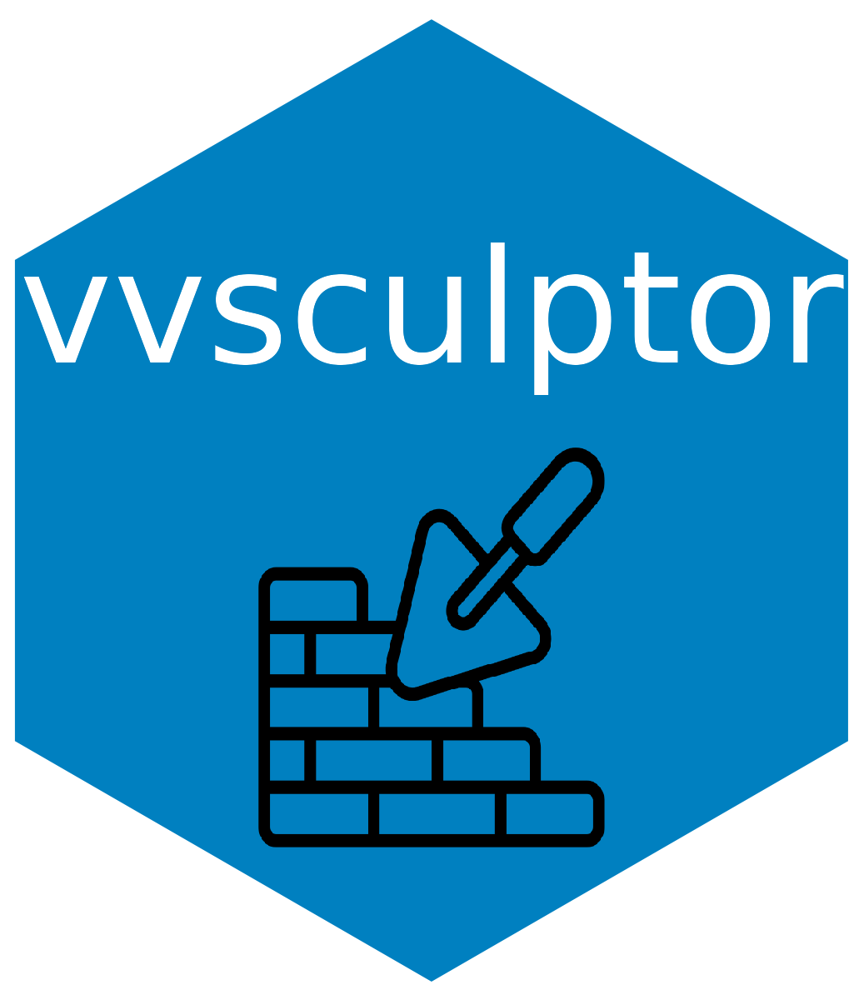

# vvsculptor <a href='https://github.com/vusaverse/vvsculptor'></a>

  <!-- badges: start -->
[](https://github.com/vusaverse/vvsculptor/actions/workflows/R-CMD-check.yaml)

[](https://www.codefactor.io/repository/github/vusaverse/vvsculptor)
[](https://CRAN.R-project.org/package=vvsculptor/)
<a href="https://diffify.com/R/vvsculptor" target="_blank"></a>
[](https://cran.r-project.org/package=vvsculptor/)
[](https://cran.r-project.org/package=vvsculptor/)
  <!-- badges: end -->


vvsculptor is an R package that provides a set of functions for manipulating data frames in accordance with specific business rules. In addition to this, it includes wrapper functions for commonly used functions from the popular 'tidyverse' package, making it easy to integrate these functions into data analysis workflows cran.r-project.org.
Installation

You can install vvsculptor from CRAN using the following command in R:

```
install.packages("vvsculptor")
```


## Contribution Guidelines

Contributions to vvsculptor are welcome. Please follow the standard GitHub process for contributing: fork the repository, make your changes, and submit a pull request.
